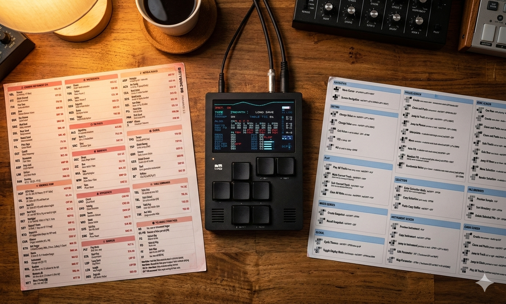

# M8 Guide & Reference

A collection of printable, high-density reference guides for the **Dirtywave M8 Tracker** (Firmware 6.5+). Big shoutout to https://github.com/LaurentVitalis/M8Guide for the original guide that a lot of the
these guides is based off (especially the well designed template for having the svg buttons generated by javascript)

## 📄 Included Guides

### 1. M8 Shortcuts Guide (`shortcuts.html`)

A single-page guide containing navigation, common actions, and context-sensitive shortcuts.

- **Design:** Optimized for US Letter or A4 paper.
- **Portability:** Designed to be folded and stored inside the official M8 case.

### 2. M8 EFX & Synthesis Reference (`efx.html`)

A single-page landscape reference for EFX commands, FM algorithms, Wavsynth parameters, and Table modes.

- **Design:** Features a vertical sidebar and flex-aligned columns for a professional reference card look.
- **Alignment:** Sections are vertically justified so that top and bottom borders line up perfectly across the page.

---

## 🖨️ Printing Instructions

To ensure the layout fills the page correctly and borders line up, use these settings in your browser's Print dialog:

1. **Destination:** Save as PDF or Select Printer.
2. **Layout:** Landscape.
3. **Margins:** **None** (or "Minimum"). The CSS provides its own safe margins.
4. **Scale:** **100%** (do not use "Fit to Page").
5. **Background Graphics:** **ON** (Required for icons and header colors).
6. **Headers and Footers:** **OFF**.

---

## 🛠️ Customization & Technical Details

### Shortcuts System

Shortcuts are stored as a JS array in `data.js` and rendered via `script.js`. This makes it easy to update descriptions or reorder sections without touching complex HTML.

### Button Icon Syntax

Button icons use a single SVG template customized via CSS classes. For example, to illustrate `hold SHIFT + OPTION then double-tap EDIT`, use:
`"command": "shifthold option1st edit2nd double"`
