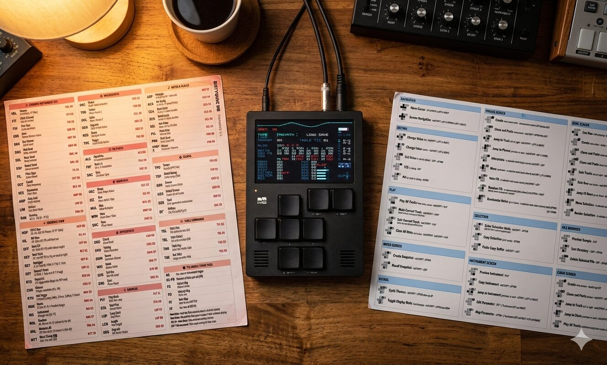

# M8 Guide & Reference

A collection of printable, high-density reference guides for the **Dirtywave M8 Tracker** (Firmware 6.6). This project is based on the original M8Guide by Laurent Vitalis — many design elements and the SVG button template used to generate the icons were adapted from that work. Thanks to Laurent for the excellent starting point: [LaurentVitalis / M8Guide](https://github.com/LaurentVitalis/M8Guide).



## 📄 Included Guides

### 1. M8 Shortcuts Guide (`shortcuts.html` → [`shortcuts.pdf`](shortcuts.pdf))

A single-page guide containing navigation, common actions, and context-sensitive shortcuts.

### 2. M8 EFX & Synthesis Reference (`efx.html` → [`efx.pdf`](efx.pdf))

A single-page reference for common instrument, sequencer, and modulation EFX commands (envelope and LFO commands by mod slot), per-synth parameters (Macrosynth, FM, Wavsynth, Hypersynth, Sampler), global commands including the DJ filter, table commands, and TIC modes. The side header shows how to open the on-device command help and how relative values work.

### 3. M8 Tips & Tricks (`tips.html` → [`tips.pdf`](tips.pdf))

A single-page set of step-by-step techniques that apply to any instrument: song arrangement, live performance, rhythm and groove, tables, and mixing and mastering. Tips are drawn from the M8 community and checked against the M8 operation manual and firmware 6.6 changelog.

### 4. Macrosynth Guide (`macrosynth.html` → [`macrosynth.pdf`](macrosynth.pdf))

A single-page deep dive into the Macrosynth: every model family with its SHAPE number and what TIMBRE and COLOR do, plus step-by-step recipes (supersaw lead, sync sweep, talking lead, bells, drone strings, 808 drums, paraphonic chords, noise risers).

### 5. FM Synth Guide (`fm.html` → [`fm.pdf`](fm.pdf))

How carriers, modulators, and op-mods work, operator controls and useful algorithms, plus recipes for FM drums, basses, chords, pads, PWM and wavetable leads.

### 6. Sampler Guide (`sampler.html` → [`sampler.pdf`](sampler.pdf))

Sampler parameters and sample editor processes, plus recipes for chopping breaks, lazy chop, tempo-synced loops, resampling, kit samples, timestretch loops, and lo-fi textures.

### 7. Hypersynth & Wavsynth Guide (`hypersynth-wavsynth.html` → [`hypersynth-wavsynth.pdf`](hypersynth-wavsynth.pdf))

Wavsynth shapes, controls, and the wavetable index, plus Hypersynth chord settings, with recipes for chip basses, PWM leads, noise drums, wavetable morphs, lush pads, chord progressions, and supersaw stabs.

All guides are laid out for **US Letter, landscape**, with a vertical side header and three columns. Sections stack with even gaps, and spare column height is shared across rows so bottom borders line up across the page.

---

## 🖨️ Building the PDFs

Regenerate every guide's PDF with headless Chrome:

```bash
bin/build-pdfs.sh            # writes all seven PDFs to the repo root
bin/build-pdfs.sh /tmp/out   # or to another directory
```

To add a guide, create its HTML file and add its name to the `guides` list in `bin/build-pdfs.sh`.

The script defaults to Google Chrome's macOS install path; set `CHROME` to use a different browser binary. The script warns (and exits non-zero) if a guide no longer fits on one page.

### Printing from a browser

If you print the HTML directly instead, use these settings in the Print dialog:

1. **Layout:** Landscape.
2. **Margins:** Default (the CSS sets its own page margins).
3. **Scale:** **100%** (do not use "Fit to Page").
4. **Background Graphics:** **ON** (required for icons and header colors).
5. **Headers and Footers:** **OFF**.

---

## 🎚️ Merging Stereo Samples

Some sample packs ship stereo sounds as separate mono files (`Kick-L.wav` and `Kick-R.wav`). `bin/merge-audio.sh` joins each pair into one stereo WAV (`Kick.wav`, 44.1kHz, 16-bit) ready to copy to the M8's SD card. It requires `ffmpeg` (for example, `brew install ffmpeg`).

```bash
bin/merge-audio.sh ~/Samples/Drums            # merge every L/R pair under this folder (recursive)
bin/merge-audio.sh --delete ~/Samples/Drums   # also remove the mono sources after a successful merge
bin/merge-audio.sh --force ~/Samples/Drums    # overwrite stereo files that already exist
```

- Pairs are matched by the `-L` / `-R` suffix (any letter case), and trailing spaces before the suffix are dropped from the output name.
- If the two channels differ in length, the shorter one is padded with silence so nothing is cut off.
- An existing `<name>.wav` is left alone unless you pass `--force`, and an L file with no matching R file is skipped.
- It prints a merged/skipped/failed summary and exits non-zero if any merge failed.

---

## 🛠️ Customization & Technical Details

### Layout

- `css/common.css` — shared page layout (columns, section boxes, side header, header colors)
- `css/shortcuts.css`, `css/efx.css` — per-guide styles; `efx.css` also provides the command tables used on the tips and instrument guides
- `css/tips.css` — step-by-step tip blocks, outlined command chips (colored by section), and parameter/model tables for the tips and instrument guides
- `js/layout.js` — counts rows in each section so spare column height is shared evenly
- `fonts/` — Sofia Sans, licensed under the SIL Open Font License (`fonts/OFL.txt`)

### Shortcuts System

Shortcuts are stored as a JS array in `js/data.js` and rendered via `js/script.js` (no dependencies). Each section has a `column` (1–3), a header `color` (`gray`, `orange`, `blue`, … from `css/common.css`, shared with the EFX guide), and a header `icon` (a key of `ICONS` in `js/script.js`), and sections render in file order within their column. This makes it easy to update descriptions or reorder sections without touching complex HTML.

### Button Icon Syntax

Button icons use a single SVG template (`<template>` in `shortcuts.html`) customized via CSS classes. Each button (`left`, `right`, `up`, `down`, `option`, `edit`, `play`, `shift`) can be combined with a suffix:

- `edit` — pressed
- `edithold` — held
- `edit1st` / `edit2nd` — pressed in sequence
- `double` — double-tap (for `edit` and `up`)

For example, to illustrate `hold SHIFT + OPTION then double-tap EDIT`, use:
`"command": "shifthold option1st edit2nd double"`
